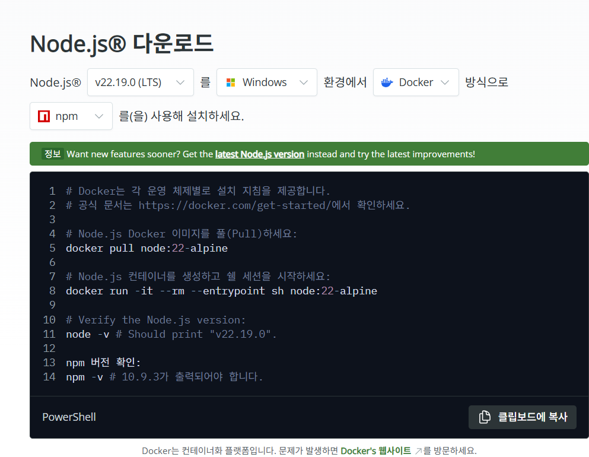
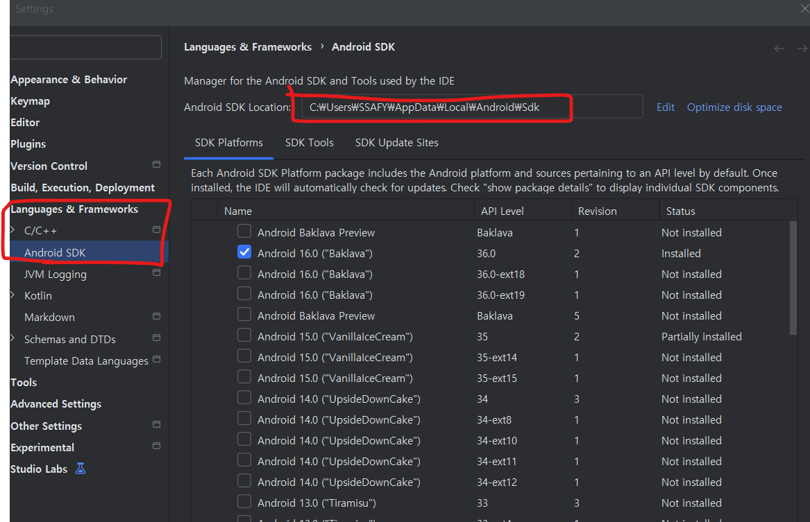
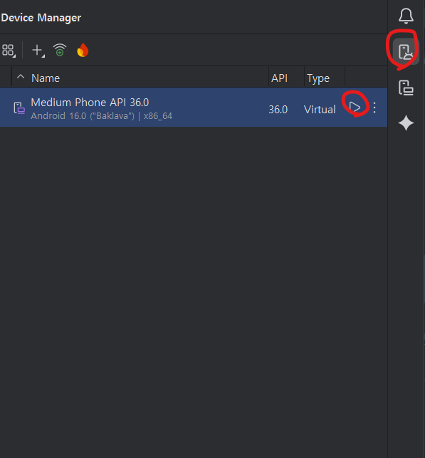
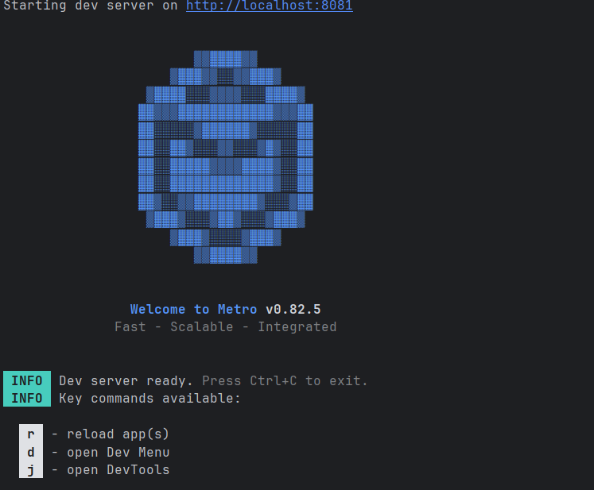
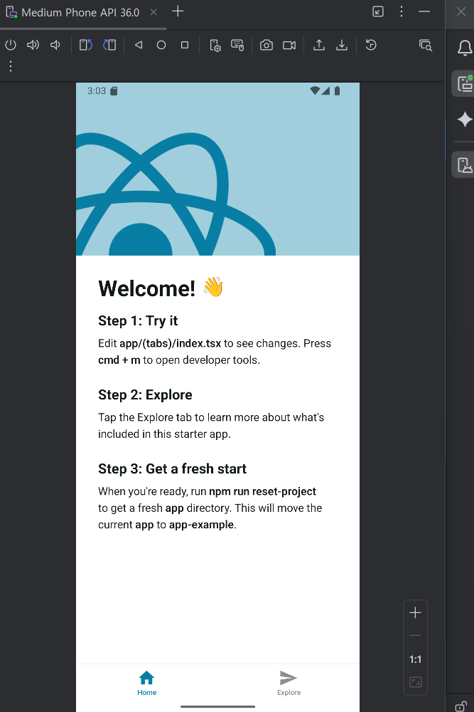

# 🚀 설치 가이드 (React Native + Expo(prebuild) + Android Studio)
## 📦 필수 환경

- Node.js: 22.19.0
-  npm: 11.6.0
- jdk : openjdk 17

각각 다음의 명령어로 확인 가능합니다.

```bash
node -v
v22.19.0
```

```bash
npm -v
11.6.0
```

```bash
java --version
openjdk 17 2021-09-14
OpenJDK Runtime Environment (build 17+35-2724)
OpenJDK 64-Bit Server VM (build 17+35-2724, mixed mode, sharing)
```

## 설치
### 1. Node.js 설치 방법
공식 [Node.js 다운로드 페이지](https://nodejs.org/ko/download)에서
LTS가 아닌, 정확히 22.19.0 버전을 선택해 설치하세요.


### 2. npm 설치 / 업그레이드 방법

npm은 Node.js 설치 시 함께 제공되지만, 버전을 맞춰야 합니다. 

현재 프로젝트는 npm 11.6.0 필요합니다.

아래 명령어로 npm을 업그레이드 시킬 수 있습니다.
```bash
npm install -g npm@11.6.0
```

### 3. open jdk 설치
[링크](https://jiurinie.tistory.com/131)에 더 자세히 정리되어있으니 참고해주세요


## 의존성
프로젝트 루트에서 실행하시면 됩니다. (package.json 내용 바탕으로 npm install 업데이트)
```bash
npm install
```

## 안드로이드 에뮬레이터 설치
**`platform-tools` 경로를 PATH에 추가**해야 인식 합니다.

이를 알려면 안드로이드 sdk가 깔린 경로를 알아야 합니다.

- 안드로이드 스튜디오를 실행하고 `File` > `Settings` (macOS는 `Android Studio` > `Preferences`) > `Android SDK`로 이동합니다.
- 상단의 **Android SDK Location**에 적힌 경로를 복사합니다.




이런 방식으로 sdk 경로를 알았다면, 아래의 방식대로 환경 변수를 설정해 줍시다.


1. **시스템 환경 변수 편집**을 엽니다.
2. **환경 변수** 를 클릭하고, 시스템 변수 목록에서 **Path**를 찾아 `편집`을 누릅니다.
3. `새로 만들기`를 클릭하고, 복사한 SDK 경로에 `\platform-tools`를 붙여서 추가합니다.
    - 예시: `C:\Users\SSAFY\AppData\Local\Android\sdk\platform-tools`
4. `확인`을 눌러 저장합니다.



사진 속에 보이는 재생 버튼을 통해 에뮬레이터를 켜줍니다.


## Metro 켜주기
메트로는 자바스크립트(리액트 네이티브) 를 안드로이드 스튜디오에서 알아먹을 수 있는 형태로 해석해주는 것입니다. 

아래 명령어를 입력합니다.

```bash
npx react-native start
```



위와 같이  나오면 성공


## 빌드 및 실행
아래 명령어를 입력합니다. 단, 에뮬레이터가 켜져 있는 상태를 권장합니다.
```bash
npx react-native run-android
```

한참을 기다린 후 build success가 뜨면 정상적으로 빌드가 이루어진 것입니다.

에뮬레이터에 아래와 같이 앱 화면이 뜨는 지 확인 꼭 해주세요

